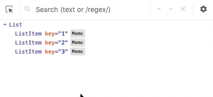

Nos complace anunciarles una nueva liberación de las Herramientas de Desarrollo de React (*React DevTools*), disponible hoy en Chrome, Firefox y (Chromium) Edge!

## ¿Qué Cambió?

¡Mucho ha cambiado en la versión 4!
A un alto nivel, esta versión debería ofrecer ganancias significativas de rendimiento y una experiencia de navegación mejorada.
También ofrece soporte completo para los Hooks de React, incluyendo la inspección de objetos anidados.


[Visite el tutorial interactivo](https://react-devtools-tutorial.now.sh/) para probar la nueva versión o [vea la bitácora de cambios](https://github.com/facebook/react/blob/master/packages/react-devtools/CHANGELOG.md#400-august-15-2019) para videos de demostración y más detalles.

## ¿Cuáles versiones de React son soportadas?

**`react-dom`**

* `0`-`14.x`: No soportada
* `15.x`: Soportada (excepto por la nueva funcionalidad de filtrar componentes)
* `16.x`: Soportada

**`react-native`**
* `0`-`0.61`: No soportada
* `0.62`: Será soportada (cuando 0.62 sea liberada)

## ¿Cómo obtengo las nuevas DevTools?

React DevTools está disponible como una extensión para [Chrome](https://chrome.google.com/webstore/detail/react-developer-tools/fmkadmapgofadopljbjfkapdkoienihi?hl=en) y [Firefox](https://addons.mozilla.org/en-US/firefox/addon/react-devtools/).
Si ya instalaste la extensión, debería actualizarse de forma automática dentro de un par de horas.

Si usas el shell independiente (ej. en React Native o Safari), puedes installar la nueva versión [desde NPM](https://www.npmjs.com/package/react-devtools):

```shell
npm install -g react-devtools@^4
```

## ¿A dónde se fueron todos los elementos del DOM?

Las nuevas DevTools proveen una forma de filtrar los componentes del árbol para hacer más fácil navegar en jerarquías profundamente anidadas.
Los nodos anfitriones (ej. HTML `<div>`, React Native `<View>`) están *ocultos por defecto*, pero este filtro puede ser deshabilitado:



## ¿Cómo obtengo de nuevo la versión anterior?

Si estás trabajando con React Native version 60 (o anterior) puedes instalar la versión anterior de DevTools desde NPM:

```shell
npm install --dev react-devtools@^3
```

Para versiones anteriores de React DOM (v0.14 o previas) necesitarás compilar la extensión desde el código fuente:

```shell
# Haz Checkout del código fuente de la extensión
git clone https://github.com/facebook/react-devtools

cd react-devtools

# Haz Checkout de la rama de la versión anterior
git checkout v3

# Instala las dependencias y compila la extensión
yarn install
yarn build:extension

# Sigue las instrucciones en pantalla para completar la instalación
```

## ¡Gracias!

Nos gustaría agradecer a todos que hicieron pruebas de la liberación temprana de DevTools versión 4.
Su feedback nos ayudó a mejorar esta liberación inicial de manera significativa.

¡Aún tenemos muchas funcionalidades emocionanetes planificadas y el feedback es siempre bienvenido!
Sientanse libres de abrir un [reporte en GitHub](https://github.com/facebook/react/issues/new?labels=Component:%20Developer%20Tools) o etiquetar [@reactjs en Twitter](https://twitter.com/reactjs).
