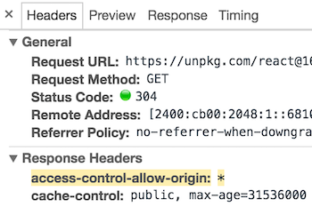

Ambos React y ReactDOM están disponibles a través de un CDN.

```html
<script crossorigin src="https://unpkg.com/react@17/umd/react.development.js"></script>
<script crossorigin src="https://unpkg.com/react-dom@17/umd/react-dom.development.js"></script>
```

Las versiones anteriores son solo para el uso en desarrollo, y no son adecuadas para el uso en producción. Las versiones de React minimizadas y optimizadas para el uso en producción están disponibles en:

```html
<script crossorigin src="https://unpkg.com/react@17/umd/react.production.min.js"></script>
<script crossorigin src="https://unpkg.com/react-dom@17/umd/react-dom.production.min.js"></script>
```

<<<<<<< HEAD
Para usar una versión específica de `react` y `react-dom`, cambia el `16` con el número de versión.
=======
To load a specific version of `react` and `react-dom`, replace `17` with the version number.
>>>>>>> 6682068641c16df6547b3fcdb7877e71bb0bebf9

### ¿Por qué el atributo `crossorigin`? {#why-the-crossorigin-attribute}

Si utilizas React desde un CDN, nosotros recomendamos mantener el atributo [`crossorigin`](https://developer.mozilla.org/es/docs/Web/HTML/Atributos_de_configuracion_CORS) puesto:

```html
<script crossorigin src="..."></script>
```

También recomendamos verificar que el CDN que estás utilizando establece el encabezado HTTP `Access-Control-Allow-Origin: *`:



Esto permite una mejor [experiencia en el manejo de errores](/blog/2017/07/26/error-handling-in-react-16.html) en React 16 y versiones posteriores.
